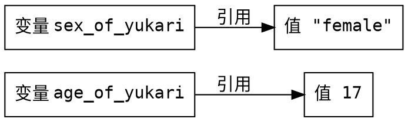

# 变量与基本类型

计算机是用于计算的机器，而程序就是计算的步骤，编程语言的功能就是描述计算的步骤。因此，用于保存值的 `变量` 是编程中最基本的概念。

变量，顾名思义就是可以改变的量，如果一个变量的值不会改变，则被称为 `常量`。

创建变量的格式为 `变量名:变量类型 = 变量的初始值`，例如：  

```python
age_of_yukari:int = 17          # 创建名为 age_of_yukari 的变量，类型为整数（int），初始值为 17
sex_of_yukari:str = "female"    # 创建名为 sex_of_yukari 的变量，类型为字符串（str），初始值为 "female"
```

* `age_of_yukari` 和 `sex_of_yukari` 是变量的名称。
* `int` 和 `str` 是变量的类型。  
* `17` 和 `"female"` 是变量的值，这种直接写出来的值被称作 **字面量（Literal）**。  



## 命名规则

变量名只能由 **字母**、**数字** 和 **下划线** 组成，并且不能以数字开头。

除此之外，还有一些约定俗成的命名习惯。参考 [PEP 8](https://peps.python.org/pep-0008/)

* 命名应当能够解释变量的作用，例如 `age_of_yukari` 表示 Yukari 的年龄。
* 变量名和函数名使用小写蛇形命名法（Snake Case），通过下划线分割单词，例如 `age_of_yukari`。
* 常量名使用大写蛇形命名法（Snake Case），通过下划线分割单词，例如 `AGE_OF_YUKARI`。
* 类名使用大驼峰命名法（Camel Case），通过大写字母分割单词且首字母大写，例如 `AgeOfYukari`。
* 私有变量使用两个下划线开头，例如 `__age_of_yukari`。
* **严禁使用**前后各两个下划线的命名，这种命名被用于特殊用途，例如 `__age_of_yukari__`。
* 有且只有一个下划线明命名的特殊变量 `_`，用于接受不被需要的值。

> 这里提及了变量以外的概念，不理解的话请暂时放下。

## Python 中的基本类型

在 Python 中有以下基本类型：  

| 类型     | 中文名     | 说明 |
| :-       | :-        | :-   |
| `int`    | 整型       | 用于保存整数，例如：`0`，`-1`，`233`                 |
| `float`  | 浮点型     | 用于保存小数，例如：`3.14`，`2.71828`                |
| `str`    | 字符串     | 用于保存文本，例如：`"hello world"`                  |
| `bool`   | 布尔型     | 用于表示逻辑的真假，只有两个值：`True` 和 `False`     | 
| `None`   | 空值       | 用于表示不存在的对象，只有一个值：`None`              |

### 整型

整型变量用于保存整数，例如：`0`，`-1`，`233`。

计算机使用二进制存储数据，因此一些涉及底层的开发中常常使用二进制、八进制和十六进制表示数值。  
Python 中使用 `0x` 前缀来表示十六进制字面量，例如：`0xff`，`0x1234abcd`。  
Python 中使用 `0o` 表示八进制，例如：`0o23`，`0o456`。  
Python 中使用 `0b` 表示二进制，例如：`0b0011`，`0b1110`。  
如果你不知道什么是二进制和十六进制的话，请查看 [通识基础 - 进制](# "TODO:页面建设中") 页面。

对于很大的整数，例如 `1000000000000`，可能很难快速看清有多少个 0，因此 Python 允许在整数字面量中使用下划线（`_`）进行分割。
因此 `1000000000000` 可以写成 `1_000_000_000_000` 或 `1_0000_0000_0000`。

### 浮点型

浮点型变量用于保存小数，例如：`3.14`，`2.71828`。
在数学上，整数是小数的特殊形式，因此整型的字面量也可以给浮点型变量赋值。

浮点型的字面量可以使用科学计数法表示，使用 `e` 表示 `×10^`。例如 `2.33e8` 表示 2.33 乘以 10 的 8 次方

> 之所以成为浮点型，是因为在计算机存储小数的格式中，用于存储整数部分的位数和用于存储小数部分的位数是可变的，即小数点的位置是浮动的。
> 与之对应的，一种用于存储整数部分的位数和用于存储小数部分的位数不可变的的格式被称为定点数。

### 字符串

字符串变量用于保存文本，例如 `"hello world"`。

字符串字面量的内容使用成对的单引号（`'`）或双引号（`"`）包裹。  
如果字符串的内容包含单引号（`'`），则通常使用双引号（`"`）包裹，  
如果字符串的内容包含双引号（`"`），则通常使用单引号（`'`）包裹。  
如果字符串的内容既有单引号（`'`）又有双引号（`"`），则需要使用反斜杠（`\`）进行转义。  
一些示例：  

```python
"I'm robot"                 # 使用双引号包裹，内容包含单引号
"I say \"hello world\""     # 使用双引号包裹，内容也包含双引号，使用反斜杠转义
```

#### 转义字符

转义字符用于表示一些无法直接表示的字符，例如 `\n` 表示换行，以下是转义字符表：  

| 转义字符 | 说明                                         |
| :-      | :-                                           |
| `\\`    | 表示反斜杠（`\`）本身                         |
| `\'`    | 表示单引号（`'`）                             |
| `\"`    | 表示双引号（`"`）                             |
| `\a`    | （用于让蜂鸣器发出响声，已不可用）              |
| `\b`    | 退格（Backspace）                            |
| `\n`    | 换行符                                       |
| `\v`    | 纵向制表符                                   |
| `\t`    | 横向制表符（Tab）                            |
| `\r`    | 回车（Return）                               |
| `\f`    | 换页                                        |
| `\oNN`  | 八进制字节，例如 `\o12` 表示换行              |
| `\xNN`  | 十六进制字节，例如 `\x0a` 表示换行符          |

### 布尔型

布尔型用于表示逻辑运算的结果，只有两个值：真（`True`）和假（`False`）。
布尔值可以通过 `and`、`or` 和 `not` 进行运算。

* `and` 表示 **与**，多个布尔值相与时，只有全部为 `True` 时结果为 `True`，否则结果为 `False`。
* `or` 表示 **或**，多个布尔值相或时，只有全部为 `False` 时结果为 `False`，否则结果为 `True`。
* `not` 表示 **非**，将一个布尔值反转。

```python shift
print("not True is", not True)
print("not False is", not False)

print("True and True is", True and True)
print("True and False is", True and False)
print("False and True is", False and True)
print("False and False is", False and False)

print("True or True is", True or True)
print("True or False is", True or False)
print("False or True is", False or True)
print("False or False is", False or False)
```

### 空值

空值表示不存在的对象，此处暂时不做具体说明。

### 类型标注

回看开头的代码，`:int` 和 `:str` 被称作 **类型标注（Type Hint）**，参考 [PEP 484](https://peps.python.org/pep-0484/)。  

```python
age_of_yukari:int = 17          # 创建名为 age_of_yukari 的变量，类型为整数（int），初始值为 17
sex_of_yukari:str = "female"    # 创建名为 sex_of_yukari 的变量，类型为字符串（str），初始值为 "female"
```

Python 是一个动态类型语言，类型标注仅作为提示，增加代码的可读性和可维护性。  

类型标注不是必须的，上述代码可以写成：  

```python
age_of_yukari = 17          # 创建名为 age_of_yukari 的变量，类型为整数（int），初始值为 17
sex_of_yukari = "female"    # 创建名为 sex_of_yukari 的变量，类型为字符串（str），初始值为 "female"
```

像这样显而易见的类型 **没有必要标注**，并且语法工具能够自动推导类型。
