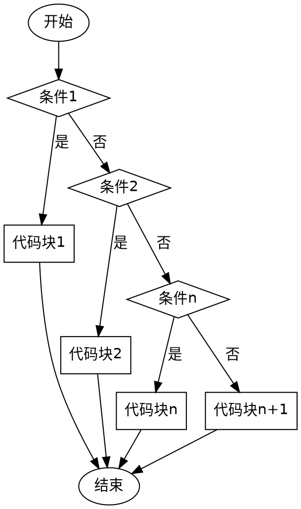

# 条件控制

在编写程序时，我们经常需要根据不同的情况执行不同的代码。例如，在一个天气应用中，如果天气晴朗，就显示“出门记得戴太阳镜”；如果下雨，就显示“出门记得带上雨伞”。
这种根据条件执行不同代码的行为称为 **条件控制**。

## 条件控制语法

参考：[Python 官方文档](https://docs.python.org/3/reference/compound_stmts.html#the-if-statement)

Python 使用 `if`、`elif` 和 `else` 来进行条件判断，其基本语法如下：

```python
if 条件1:
    代码块1
elif 条件2:
    代码块2

...

elif 条件n:
    代码块n
else:
    代码块n+1
```



例如：  

```python shift
SUNNY:int = 1   # 晴天
RAINY:int = 2   # 雨天

weather:int = SUNNY

if weather == SUNNY:
    print("出门记得戴太阳镜")
elif weather == RAINY:
    print("出门记得带上雨伞")
```

## 代码块

Python 的代码块通过 **缩进** 进行区分，例如：  

```python shift
if True:
    if False:
        print("这是内层 if 条件的代码块")
        print("这是内层 if 条件的代码块")
    print("这是外层 if 条件的代码块")
print("这是最外层代码块")
```

缩进的方式并没有明确规定，但通常使用 **四个空格**。

## 练习

请实现判断一个整数是偶数还是奇数，通过 `input` 获取输入。

* 可以被 2 整除的整数是偶数，不能被 2 整除的整数是奇数。

```python shift 19
number:int = int(input("请输入一个整数："))

if True:  # 修改此处代码，判断 number 是偶数还是奇数
    print(number, "是偶数")
else:
    print(number, "是奇数")
```

