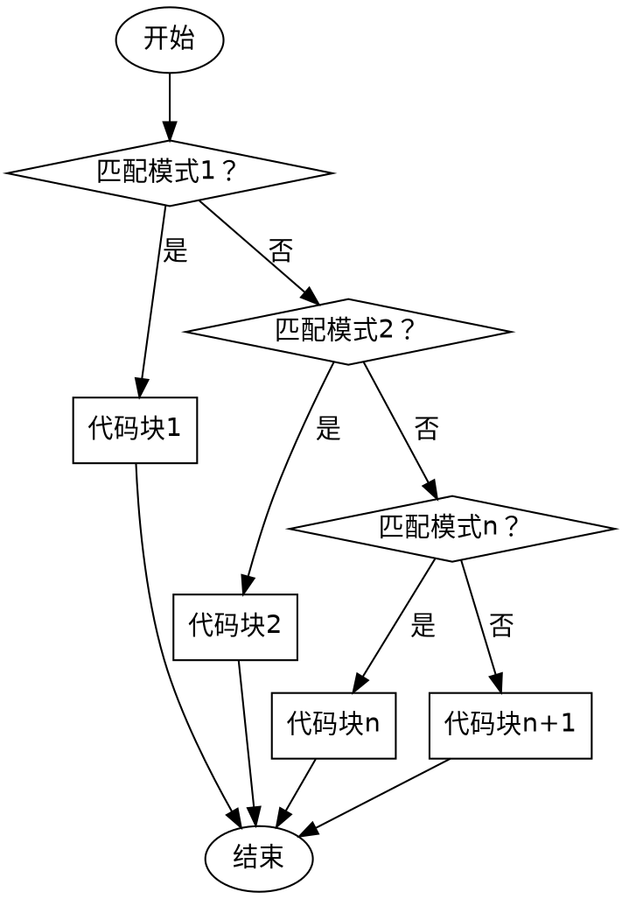

# 模式匹配

!class:view-message-warning
Python 版本需要 $\geq$ 3.10，参考 [PEP 634](https://peps.python.org/pep-0634/)。

模式匹配（Pattern Matching）是一种检查变量是否符合某种模式的语法结构，通过 `match` 和 `case` 进行控制

```python
match 变量:
    case 模式1:
        代码块1
    case 模式2:
        代码块2
    ...
    case 模式n:
        代码块n
    case _:         # 无条件匹配
        代码块n+1
```



按照先后顺序检查模式，只执行第一个匹配的模式下的代码块。

## 精确匹配

模式为精确值，变量与模式相等时匹配。例如：  

```python shift 3
value:int = int(input("好评请按1，差评请按2，投诉请按3："))
match value:
    case 1:
        print("好评")
    case 2:
        print("差评")
    case 3:
        print("投诉")
    case _:                 # 无条件匹配
        print("无效输入")
```

## 条件匹配

模式为条件表达式，变量满足表达式时匹配。例如：

```python shift 71
age:int = int(input("请输入你的年龄："))
match age:
    case x if x < 3:        # 匹配成功时，age 会赋值给 x
        print(x, "岁婴儿")
    case x if x < 18:
        print(x, "岁少年")
    case x if x < 44:
        print(x, "岁青年")
    case x if x < 59:
        print(x, "岁中年")
    case x:                 # 无条件匹配
        print(x, "岁老年")
```

!class:view-message
还有多种模式，将在后面的内容中学习。

