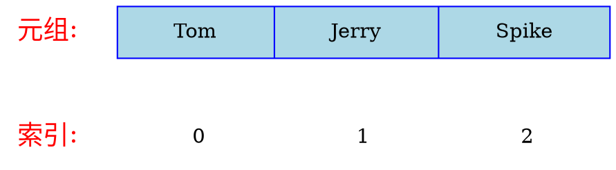

# 元组（tuple）

**元组（tuple）** 是一组有序数据的 **不可变** 集合。

元组的字面量使用圆括号（`()`）包裹一组值表示，例如：  

```python
students:tuple[str, str, str] = ("Tom", "Jerry", "Spike")
```



类型标注 `tuple[str, str, str]`，表示类型为 **包含三个元素，元素类型依次为 `str`, `str`, `str` 的元组**

元素的类型可以不同，例如:  

```python
student_info:tuple[str, int, str] = ("Yukari", 17, "female")
```

通过元组后跟方括号（`[]`）索引访问元组的元素，和绝大多数编程语言一样，Python 的 **索引从 0 开始**：

```python shift
students:tuple[str, str, str] = ("Tom", "Jerry", "Spike")
print(students)
print(students[0])
print(students[1])
print(students[2])
```

元组一旦被创建，就无法改变了，不能增加、删除或修改任何一个元素。  
但是可以对变量重新赋值，这不是改变了元组，而是重新创建了变量。

```python
students:tuple[str, str, str] = ("Tom", "Jerry", "Spike")
students = 10
```

但是，如前文所述，建议 **不要修改变量的类型**。

## 空元组和只有一个元素的元组

可以创建没有值的空元组：  

```python
empty:tuple[()] = ()
```

创建只有一个元素的元组时，需要保留一个逗号（`,`），因为圆括号（`()`）的功能较多，会产生歧义：  

```python
student:tuple[str] = ("Tom",)
```
