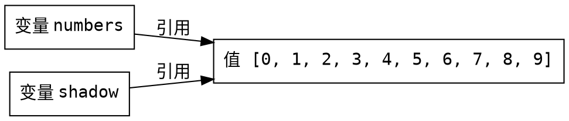
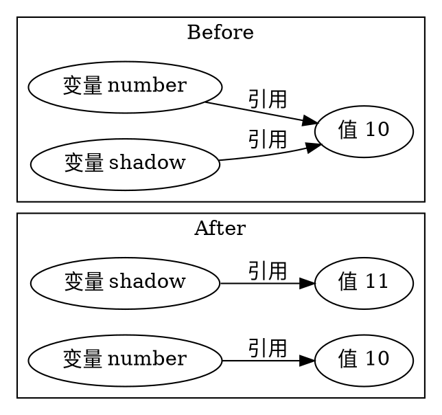

# 列表（list）

**列表（list）** 是一组有序数据的 **可变** 集合。

列表的字面量使用方括号（`[]`）包裹一组值表示，例如：  

```python
students:list[str] = ["Tom", "Jerry", "Spike"]
```


类型标注 `list[str]`，表示类型为 **元素类型为 `str` 的列表**

!class: view-message-warning
参考 [PEP 585](https://peps.python.org/pep-0585/)，此类型标注需要 Python 版本 $\geq$ 3.9，之前的版本需要引用 `typing` 模块。

列表的元素类型可以不同，例如：  

```python
ages:list[int|str] = [15, "16", 17]
```

类型标注 `list[int|str]`，表示类型为 **元素类型为 `int` 或 `str` 的列表**

> 如果没有合理的理由，请不要使用元素类型不定的列表

列表和元组一样，通过列表后跟方括号（`[]`）索引访问元素，**索引从 0 开始**，并且列表的元素是可以修改的：

```python shift
students:list[str] = ["Tom", "Jerry", "Spike"]
print(students)
print(students[0])
print(students[1])
print(students[2])

students[1] = "Tuffy"
print(students)
```

## 添加元素

Python 提供了多种方式向列表插入元素，主要包括 `append`、`insert` 和 `extend`：  

* `append` - 在末尾追加元素
* `insert` - 在指定位置插入元素
* `extend` - 将另一个列表合并到末尾

示例：  

```python shift
numbers:list[int] = [0, 1, 2, 3, 4, 5, 6, 7, 8, 9]

numbers.append(10)          # 末尾追加 10
numbers.insert(2, 233)      # 在索引为 2 的位置插入 233
numbers.insert(233, 666)    # 索引 233 超出了当前长度，因此在末尾追加 666
print(numbers)
```

## 删除元素

Python 提供了多种方式向列表插入元素，主要包括 `pop` 和 `remove`： 

* `pop` - 删除指定索引的元素，不指定索引则删除末尾的元素
* `remove` - 删除第一个等于指定值的元素

示例：

```python shift
numbers:list[int] = [0, 1, 2, 3, 4, 5, 6, 7, 8, 9]

numbers.pop()               # 删除末尾元素
numbers.pop(2)              # 删除索引为 2 的元素
numbers.remove(7)           # 删除值为 7 的第一个元素
print(numbers)
```

## 清空列表

通过 `clear` 方法可以清空列表：

```python shift
numbers:list[int] = [0, 1, 2, 3, 4, 5, 6, 7, 8, 9]

numbers.clear()             # 清空列表
print(numbers)
```

## 引用类型

Python 的 **所有类型都是引用类型**，如果将一个变量赋值给另一个变量，它们将引用同一份实体。参考 [Python 官方文档 - 可变序列](https://docs.python.org/3/reference/datamodel.html#mutable-sequences)

因此，对于列表而言，通过任意一个变量修改列表都会影响到另一个变量：  



```python shift
numbers:list[int] = [0, 1, 2, 3, 4, 5, 6, 7, 8, 9]  # 创建了列表 [0, ..., 9]，并赋值给变量 numbers
shadow:list[int] = numbers                          # 变量 numbers 赋值给 shadow，也即引用源头的 [0, ..., 9]

numbers[1] = 233                                    # 通过 numbers 修改列表元素
shadow[2] = 666                                     # 通过 shadow 修改列表元素

print(numbers)                                      # 可以看到 numbers 和 shadow 都被修改了
print(shadow)
```

之前学习的基本类型和元组都属于不可变类型，对他们的修改实际上是创建了一个新的对象。参考 [Python 官方文档 - 不可变序列](https://docs.python.org/3/reference/datamodel.html#immutable-sequences)

因此，引用同一个实体的对象之间不会感知到互相影响：  



```python shift
number:int = 10         # 创建了值为 10 的整数，并赋值给变量 number 
shadow:int = number     # 变量 number 赋值给 shadow，也即引用源头的 10

number = 11             # 修改 number 并非将 10 修改为11，而是创建了新的值为 11 的整数并赋值给 number

print(number)           # number 引用的值为 11
print(shadow)           # shadow 仍引用原先的值
```

如果想要两个列表互不影响，就需要创建新的列表：  

```python shift
numbers:list[int] = [0, 1, 2, 3, 4, 5, 6, 7, 8, 9]  # 创建了列表 [0, ..., 9]，并赋值给变量 numbers
shadow:list[int] = list(numbers)                    # 基于 numbers 的值创建新的列表，并赋值给 shadow

numbers[1] = 233                                    # 通过 numbers 修改列表元素
shadow[2] = 666                                     # 通过 shadow 修改列表元素

print(numbers)
print(shadow)
```

## len 函数

通过内建函数 `len` 可以获得元组和列表的长度。

示例：

```python shift
numbers_tuple:tuple[int, ...] = (0, 1, 2, 3, 4, 5, 6, 7, 8, 9)
numbers_list:list[int] = [0, 1, 2, 3, 4, 5, 6, 7, 8, 9]

print(len(numbers_tuple))
print(len(numbers_list))
print(len(numbers_list[2:7]))
```