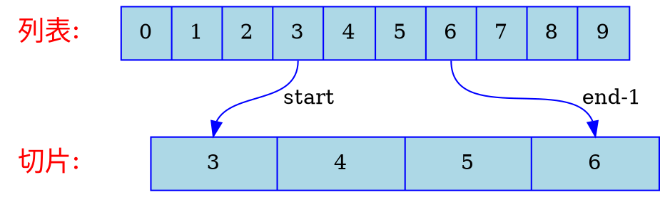

# 切片操作

切片是对元组和列表中部分元素创建的视图，有以下写法：  

```python
tuple_or_list[:]                    # 所有元素的切片
tuple_or_list[start:]               # 从 索引start 到 最后一个元素 的切片
tuple_or_list[:stop]                # 从 索引0 到 索引stop 的切片，不含 索引stop
tuple_or_list[start:stop]           # 从 索引start 到 索引stop 的切片，不含 索引stop
tuple_or_list[start:stop:step]      # 从 索引start 到 索引stop 的切片，不含 索引stop，步长为 step
```



例如：  

```python shift
numbers:list[int] = [0, 1, 2, 3, 4, 5, 6, 7, 8, 9]
print(numbers[:])
print(numbers[5:])
print(numbers[:3])
print(numbers[1:4])
print(numbers[2:7:3])
```

## 修改源列表

切片是对源列表的引用，因此修改切片的元素等同于修改源列表的元素：

```python shift
numbers:list[int] = [0, 1, 2, 3, 4, 5, 6, 7, 8, 9]
numbers[2:7] = [233]    # 将 索引2 到 索引7，不含 索引7 替换为 [233]
print(numbers)
```

如果将切片赋值给一个变量，该变量会基于此切片创建新的对象，将不再引用源列表：

```python shift
numbers:list[int] = [0, 1, 2, 3, 4, 5, 6, 7, 8, 9]
shadow:list[int] = numbers[2:7]     # 将 索引2 到 索引7，不含 索引7 赋值给变量 shadow，将创建新的列表
shadow[1] = 233                     # 修改 shadow 元素的值，不会影响 numbers
print(shadow)
print(numbers)
```

因此可以通过切片简化列表的复制操作：

```python
numbers:list[int] = [0, 1, 2, 3, 4, 5, 6, 7, 8, 9]
shadow:list[int] = numbers[:]       # 复制 numbers
# shadow:list[int] = list(numbers)  # 等价
```