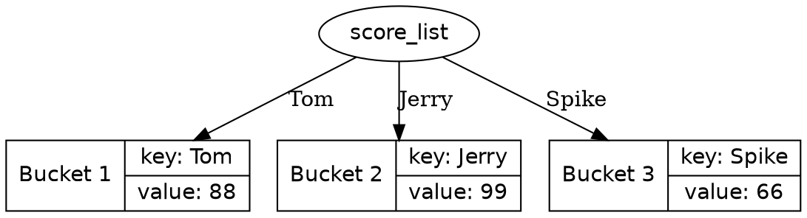

# 字典（dict）

字典通过哈希表（Hash Table）实现，是一种高效的数据结构，查找元素、插入元素、删除元素都具有较快的速度。

字典的字面量使用花括号（`{}`）包裹一组 **键（key）-值（value）对** 表示，例如：

```python
score_list:dict[str,int] = {
    'Tom': 88,
    'Jerry': 99,
    'Spike': 66
}
```



类型标注 `dict[str,int]`，表示类型是 **键（key）类型为 `str` ，值（value）类型为 `int` 的字典**。

!class: view-message-warning
参考 [PEP 585](https://peps.python.org/pep-0585/)，此类型标注需要 Python 版本 $\geq$ 3.9，之前的版本需要引用 `typing` 模块。

> 字面量中的 `Tom`、`Jerry`、`Spike` 是键（Key），`88`、`99`、`66` 是值（Value）。

通过字典后跟方括号（`[]`）键（key）访问元素，例如:  

```python shift
score_list:dict[str,int] = {
    'Tom': 88,
    'Jerry': 99,
    'Spike': 66
}

print(score_list)
print('Jerry 的成绩是', score_list['Jerry'])
```

在数据量较大时，相较于列表，查找时不仅简单，而且速度也要更快。

```python shift
# 通过列表与元组的嵌套保存成绩单
score_list:list[tuple[str, int]] = [('Tom', 88), ('Jerry', 99), ("Spike", 66)]

# 通过循环查找 Jerry 的成绩
index:int = 0
while index < len(score_list):
    if score_list[index][0] == 'Jerry':
        print('Jerry 的成绩是', score_list[index][1])
        break
    index += 1
else:
    print("没有找到 Jerry 的成绩")
```

## 通过 in 判断 key 是否存在

如果尝试读取一个不存在的 key，会产生错误:  

```python shift
score_list:dict[str,int] = {
    'Tom': 88,
    'Jerry': 99,
    'Spike': 66
}

print(score_list['Tuffy'])
```

可以通过 `in` 来判断 key 是否在字典中:  

```python shift
score_list:dict[str,int] = {
    'Tom': 88,
    'Jerry': 99,
    'Spike': 66
}

print('Tuffy' in score_list)
print('Tuffy' not in score_list)
```

## 增加或修改元素

字典后跟方括号（`[]`）键（key）可以增加或修改元素：  

```python shift
score_list:dict[str,int] = {
    'Tom': 88,
    'Jerry': 99,
    'Spike': 66
}

score_list['Spike'] = 77    # Spike 已经存在，因此修改元素的值
score_list['Tuffy'] = 33    # Tuffy 不存在，因此增加元素
print(score_list)
```

## 删除元素

通过 `pop` 方法可以删除字典元素：  

```python shift
score_list:dict[str,int] = {
    'Tom': 88,
    'Jerry': 99,
    'Spike': 66
}

score_list.pop('Jerry')
print(score_list)
```

## 清空字典

通过 `clear` 方法可以清空列表：

```python shift
score_list:dict[str,int] = {
    'Tom': 88,
    'Jerry': 99,
    'Spike': 66
}

score_list.clear()             # 清空列表
print(score_list)
```

## 合并字典

通过 `update` 方法，可以合并另一个字典的元素：  

```python shift
schoole_score_list:dict[str,int] = {
    'Tom': 88,
    'Jerry': 99,
    'Spike': 66
}

class1_score_list:dict[str,int] = {
    'Tom': 77,
    'Tuffy': 33,
}

schoole_score_list.update(class1_score_list) # 将 class1_score_list 合并入 schoole_score_list，class1_score_list 同名键的值将覆盖 schoole_score_list
print(schoole_score_list)
```

## 复制字典

和列表一样，直接将字典赋值给另一个变量，将会互相影响，如果不希望这样，就需要复制字典：  

```python shift
score_list:dict[str,int] = {
    'Tom': 88,
    'Jerry': 99,
    'Spike': 66
}

shadow:dict[str,int] = score_list           # 引用源字典
shadow['Spike'] = 77                        # 通过 shadow 修改，score_list 也受到影响

shadow2:dict[str,int] = dict(score_list)    # 创建新字典
shadow2['Spike'] = 55                       # 通过 shadow2 修改，score_list 不受到影响

print(score_list)
print(shadow)
print(shadow2)
```